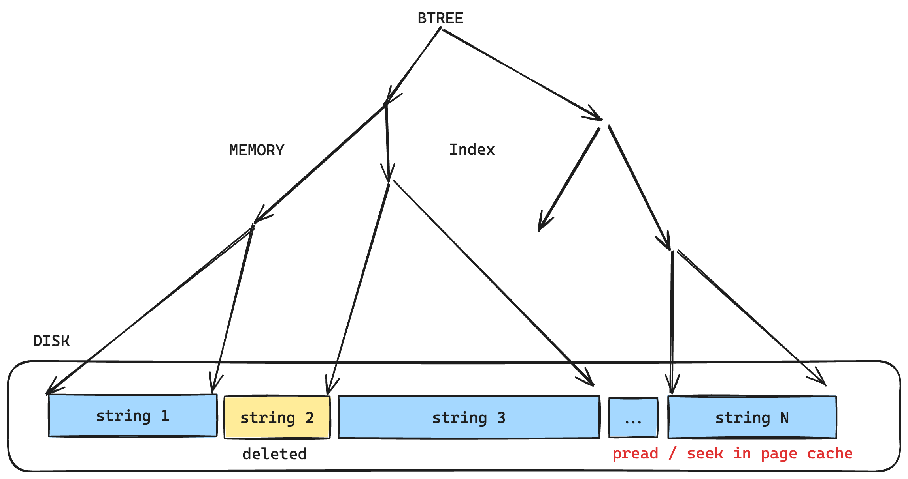
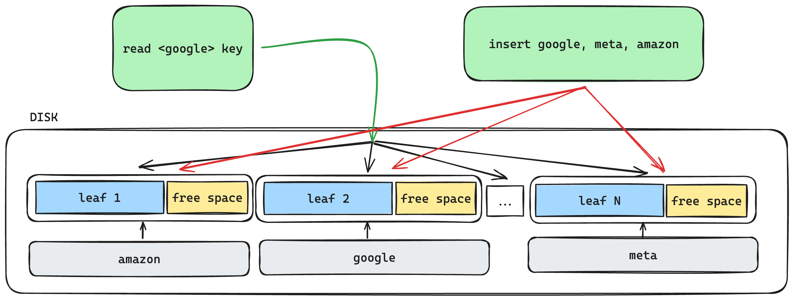
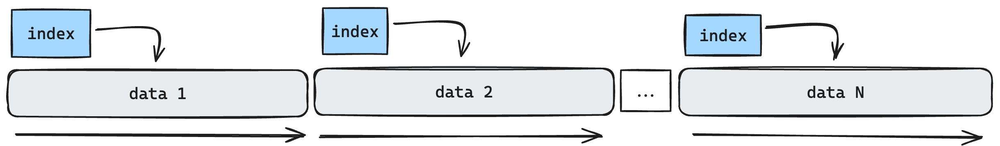
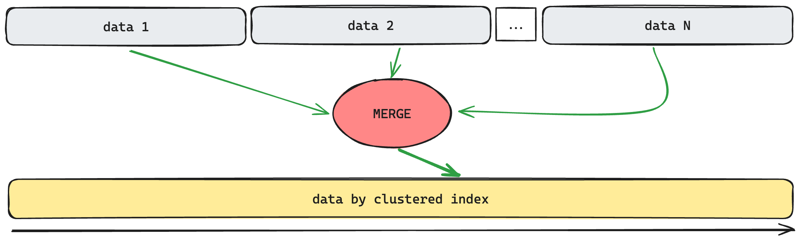

# text_idx
The `text_idx` project offers an efficient Java-based implementation of two key functionalities:

- `Sparse Indexing`: It provides a mechanism for creating sparse indexes using N structured files, 
facilitating effective search operations based on these indexes. This approach allows for efficient retrieval of data 
based on specific criteria, enhancing the performance of search operations.
- `Log-Structured Merge Trees (LST)`: The project also includes a log-structured tree implemented within a structured string table, 
along with a write-ahead log. This architecture enables efficient storage and retrieval of data, with changes logged 
in a structured manner to ensure data integrity and consistency.

### Theory
Any modular database system must support out of box one or more storage systems: memory table, log tree, write-ahead log, etc. 

The storage system plays a crucial role by handling the following responsibilities:
- Data Storage, Reading, and Writing
- Access Control and Synchronization
- Data Replication

#### How to store data in the merge tree
If we need to store data, most logical way to build data would store data along with **index**. Index is a key to allow
not read/scan all the data, but rather than, to find particular set of data by key. Most obvious (and though very 
effective by write amplification) way to build that key is `BTree` data structure. For that case, `BTree` is going to 
represent key in according to data **position and shift on the disk** in its leafs (shift in the file). 
`BTree` is the search tree which assumes **wide nodes** for more effective work on the disk (HDD, SSD).

Let's consider simplest way to make that tree over file:



- `insert` is very simple (efficient). We just add string in the end of file (_data are ordered by the time in ascending order_).
- `delete` is happening by key. That just leaves hole in the simplest case and might be replaced by another value later.
- `read` is also very simple _in key-value scenario_. Index is located in memory as tree-based structure with keys on 
the tree nodes and data value position and shift on the leafs. So that is fairly simple to get position / shift by index 
and read value data using `pread` syscall.

The problem of scenario considered above is this effectively work for unique key attached to value (key-value index).

Let's try to consider a bit more real scenario - before we tried to manipulate with abstract
key/value tuple, but now lets imaging we collect statistics from different websites - by example Google, Meta and Amazon.

That data have been shuffled randomly, spread out evenly and put into file. How'd we get Google data from the file? 
Base on the previews design of our index data structure we can do many very small seeks by index or iterate through the 
whole file to get data (`scan` file). Advantage of this approach would be: 
- simple (efficient) on `insert`
- complicated (not efficient) on the `read` for any **batch reading** (as been said before for single key-value scenario
`read` should efficiently along with `insert`).

Other scenario which used by many modern relational database engines is BTree with storing data exactly on leafs of the tree.
(cache by pages - leafs on the disk, index tree nodes in the memory). In this configuration:
- **data physically ordered by key** what is great, just need to effectively configure more free space on the leaf to 
put additional data to leaf by index on insert.
- as result, it is simple and efficient way to `read` data by one key, because all data by key grouped in one chunk on the leaf.
This configuration is called **clustered index**.
- `insert` is getting complicated. you have to make as many seeks as much ingress you have by key to insert data because 
ingress is sorted by time naturally, not by index.



As outcome - _in opposite to first case, insert is getting very complicated and read is getting simple_.

Both approaches have their advantages and concerns (good `read`/ bad `insert` vs bad `read`/ good `insert`) and 
we'd want to make something what can bring best of two approaches with both good `read` and `insert`.

As you may notice, fundamental problem in both approaches is **data coming not in the order they must be when we need read them**.
That means data need to be **re-ordered at some point**. We can't meantime reorder data on insert or read because it will 
drastically slow down process of reading / writing. So as outcome here - _reorder must happen as background process_.

- **(1)** let's insert data file by file, ordered by some index (`sstable`)
  
- **(2)** any coming data for insert come to in-memory tree in some sorted order (`memtable` usually or tree-based index in memory).
- **(3)** in the background, we're going to choose N files and merge them into one. As result, we
must have only one file **ordered by primary key**
  
- **(4)** why do we need **write-ahead log**? Since (2) is placed in memory we need disk log for **durability** of our systeml
- That's how we come to LSM - log-structured (write-ahead log) merge tree (N string structured files, 
that is actually not a tree, just number of files on the disk)

Big disadvantage of this structure is bad write amplification since we have to merge (eg. re-write and delete) same data 
few or many times.

### Implementation
The `text_idx` project API and data flows are presented below:

#### `put` / `remove` API flow:


#### `get` API flow:


#### `put` / `get` data flow:


Implementation includes:

- **Block**: Located at src/main/java/store/lsm/block, the Block module serves as the fundamental unit for data and operations. 
Block operations are defined by the semantics of the Block class, utilizing operations such as `St` (Store) and `Rm` (Remove).
- **Index**: The index API, found at `src/main/java/store/lsm/index`, encompasses the definition of both index 
and sparse index structures. Notably, it includes an implementation for sparse index queries. For detailed insights into 
sparse index functionality, refer to the `src/main/java/store/lsm/index/SparseIndexQuery.java` class, and for a 
comprehensive understanding, explore `src/test/java/lsm/index/SparseIndexTest.java`.
- **Structured string table**: The table module provides an API for structured string tables. Each table consists of table metadata, 
defined in `src/main/java/store/lsm/table/TableMetaData.java`, and `N` segments containing serialized blocks indexed appropriately. 
The entire `sstable` implementation is encapsulated within `src/main/java/store/lsm/table/StructuredStringTable.java`.
- **Write Ahead Log (WAL)**: The wal module is responsible for implementing the Write Ahead Log concept, as described in 
write ahead logging. This functionality is realized in `src/main/java/store/lsm/wal/WriteAheadLog.java`.
- **LSM (Log-Structured Merge Tree)**: The lsm module serves as the developer API, residing in `src/main/java/store/lsm/Lsm.java`. 
It facilitates the CRUD operations for key/value entities and manages the orchestration logic between the Write Ahead Log 
and the structured string files to ensure efficient CRUD operations.

### Results
Developer API and results shown in the unit test 
[LsmTest.java](https://github.com/alexgaas/text_idx/blob/4b60ce1ee2f15a0b2d309917737d63314628a58e/src/test/java/lsm/LsmTest.java)

**Developer API** example:
```text
try(Store lsm = new Lsm(baseTestPath, 4, 3)) {
    // put test data
    for (int i1 = 0; i1 < 10; i1++) {
        lsm.put(String.valueOf(i1), String.valueOf(i1));
    }
    // assert data in the LSM store
    for (int i1 = 0; i1 < 10; i1++) {
        assertEquals(String.valueOf(i1), lsm.get(String.valueOf(i1)));
    }
    // remove data from LSM store
    for (int i1 = 0; i1 < 10; i1++) {
        String s = String.valueOf(i1);
        lsm.remove(s);
    }
    // assert data have been removed
    for (int i = 0; i < 10; i++) {
        String s = lsm.get(String.valueOf(i));
        Assertions.assertNull(s);
    }
}
```

### TODO
- `merge` phase is not implemented yet
- `serde` (serialization / deserialization) level is not separated from LSM. It is though mixed up -
I used manual byte serialization / deserialization for write ahead log and `ObjectMapper` for string structured tables
- `text_idx` uses `RandomAccessFile` for most of IO operations. This IO API in fact is
deprecated and have to be replaced with `FileChannel`. Details in this article -
  https://github.com/alexgaas/java_file_io
- there is no `BloomFilter`
- no effective benchmark tests
- to run unit tests successfully following folders in `src/test/resources` must be created before run:
`lsm`, `metadata`, `sparse_index`, `sstable`, `wal`

### License
MIT - https://github.com/git/git-scm.com/blob/main/MIT-LICENSE.txt