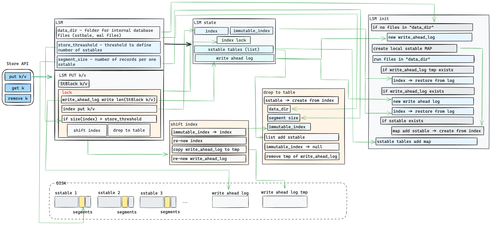
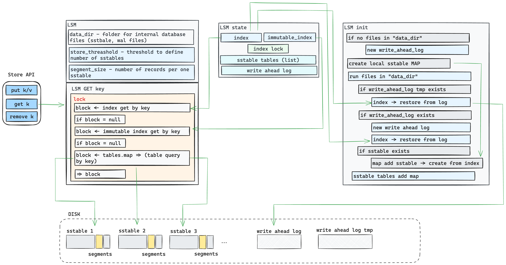
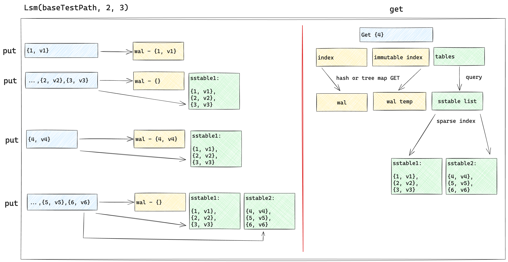

# text_idx
The project `text_idx` is effective _Java_-based implementation of:
- sparse index by many structured files and effective search by index
- log-structured merge tree (within structured string table and write ahead log)

### Explanation

**LSM** `put` / `remove` API design flow:



**LSM** `get` API design flow:



**LSM** `put` / `get` data flow:



### Results
Developer API and results shown in the unit test 
[LsmTest.java](https://github.com/alexgaas/text_idx/blob/4b60ce1ee2f15a0b2d309917737d63314628a58e/src/test/java/lsm/LsmTest.java)

**Developer API** example:
```text
try(Store lsm = new Lsm(baseTestPath, 4, 3)) {
    // put test data
    for (int i1 = 0; i1 < 10; i1++) {
        lsm.put(String.valueOf(i1), String.valueOf(i1));
    }
    // assert data in the LSM store
    for (int i1 = 0; i1 < 10; i1++) {
        assertEquals(String.valueOf(i1), lsm.get(String.valueOf(i1)));
    }
    // remove data from LSM store
    for (int i1 = 0; i1 < 10; i1++) {
        String s = String.valueOf(i1);
        lsm.remove(s);
    }
    // assert data have been removed
    for (int i = 0; i < 10; i++) {
        String s = lsm.get(String.valueOf(i));
        Assertions.assertNull(s);
    }
}
```

### TODO
- `text_idx` uses `RandomAccessFile` for most of IO operations. This IO API in fact is
deprecated and have to be replaced with `FileChannel`. Details in this article -
  https://github.com/alexgaas/java_file_io
- there is no `BloomFilter`
- no effective benchmark tests
- to run unit tests successfully following folders in `src/test/resources` must be created before run:
`lsm`, `metadata`, `sparse_index`, `sstable`, `wal`

### License
MIT - https://github.com/git/git-scm.com/blob/main/MIT-LICENSE.txt